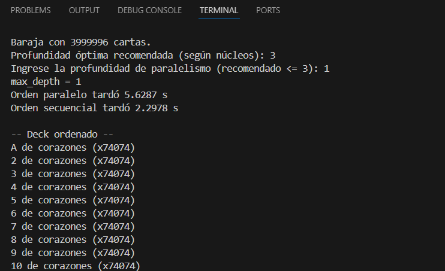

# Proyecto: Ordenamiento Paralelo y Secuencial de Cartas

Este repositorio muestra cómo generar y ordenar hasta cuatro millones de cartas 
(*corazones*, *tréboles*, *picas*, *diamantes* y *comodines*) mediante dos enfoques:

1. **Ordenamiento Secuencial**: Usa la función interna `sorted` de Python.  
2. **Ordenamiento Paralelo**: Implementa un _merge sort_ con `ProcessPoolExecutor`, 
   dividiendo el problema en subproblemas para aprovechar múltiples núcleos.

Al final, el programa imprime las cartas ordenadas, **agrupando duplicados consecutivos**.

---

## Contenido

- **`Card` y `Deck`**: Clases que representan la estructura de las cartas y la baraja.
- **`parallel_merge_sort`**: Función que ordena en paralelo usando _merge sort_.
- **`merge`**: Función auxiliar para mezclar (merge) dos listas ordenadas.
- **`print_deck_with_duplicates`**: Imprime las cartas ordenadas agrupando duplicados.
- **Constantes `suits_order` y `ranks_order`**: Definen la prioridad de palos y rangos.

---

## Ejecución

1. **Clona o descarga** este repositorio.  
2. **Instala Python 3.7+** (o superior).
3. **Ejecuta** en tu terminal:  
   ```bash
   python main.py

A continuación puedes ver la captura de pantalla de la ejecución en la terminal:


